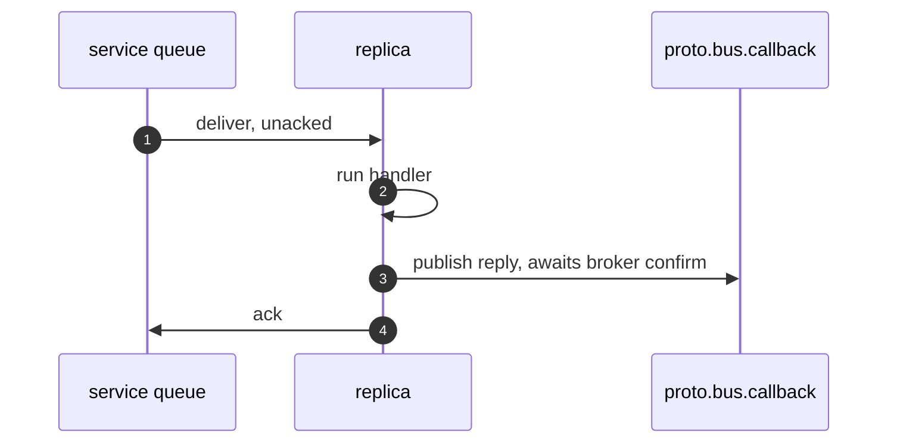
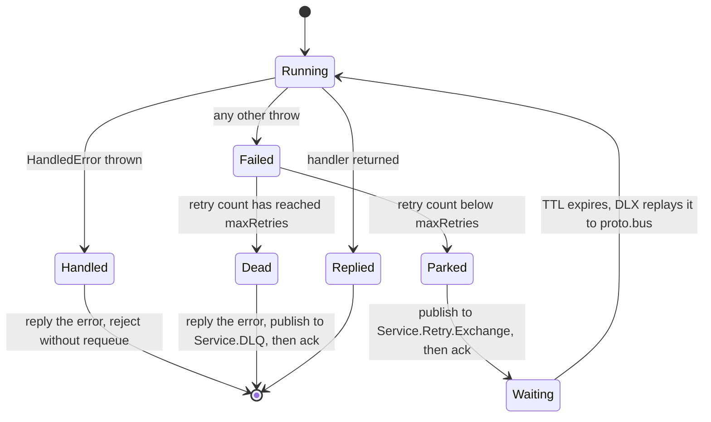
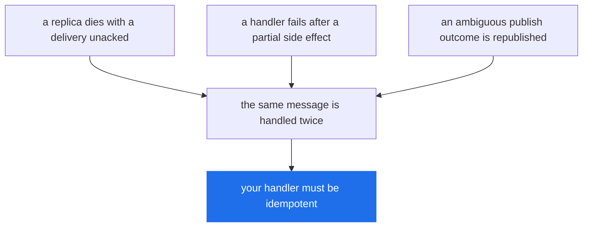

# Delivery Guarantees

> What a resolved `publish()` actually promises, what happens to a message whose handler threw, and where duplicates come from.

**Read this if** you are deciding how much your handlers have to defend themselves — or you are staring at a non-empty `<Service>.DLQ` and want to know how those messages got there.

| | |
|---|---|
| **Prerequisites** | [Architecture](./architecture.md) — you know what a service declares in the broker |
| **Next** | [Error Handling](../guide/error-handling.md) · [Configuration](../reference/configuration.md) · [Troubleshooting](../operations/troubleshooting.md) |
| **Source** | [`lib/connection.ts`](../../lib/connection.ts) · [`lib/message_listener.ts`](../../lib/message_listener.ts) · [`lib/message_dispatcher.ts`](../../lib/message_dispatcher.ts) · [`lib/message_service.ts`](../../lib/message_service.ts) · [`lib/errors.ts`](../../lib/errors.ts) · [`lib/config.ts`](../../lib/config.ts) |

**On this page** — [The claim](#the-claim) · [What a resolved publish means](#what-a-resolved-publish-means) · [Ack ordering](#ack-ordering) · [The retry ladder](#the-retry-ladder) · [The x- headers](#the-x--headers) · [The parked caller](#the-parked-caller) · [Where duplicates come from](#where-duplicates-come-from) · [What to do about it](#what-to-do-about-it)

---

## The claim

Protobus gives you **at-least-once delivery with publisher confirms**, and nothing stronger.

Every part of that sentence is load-bearing:

- **At-least-once** — a message that is delivered may be delivered again. There is no deduplication anywhere in the library.
- **With publisher confirms** — a `publish()` that resolves means RabbitMQ said it has the message, not that a local buffer accepted the bytes.
- **Nothing stronger** — there is no exactly-once, no transactional handoff between the message and your database, and no ordering guarantee across replicas.

The rest of this page is what that costs you and what the library does to keep the cost small.

---

## What a resolved publish means

Channels are opened with `createConfirmChannel()` ([`lib/connection.ts`](../../lib/connection.ts), `openChannel`). A resolved `publish()` therefore means all three of:

1. the broker positively confirmed the publication (`basic.ack`);
2. it was **routed**, when `mandatory` asked for routing to be enforced;
3. the channel's local write buffer has drained.

Everything else is a typed rejection. There are four, and the split that matters is not "which error" but **whether the outcome is known**.

| Error | `code` | Outcome | Safe to republish? |
|---|---|---|---|
| `PublishNackedError` | `PUBLISH_NACKED` | Definite: the broker refused it, nothing was stored | Yes |
| `UnroutableError` | `UNROUTABLE` | Definite: it reached the exchange and matched no queue | Yes |
| `PublishConfirmTimeoutError` | `PUBLISH_CONFIRM_TIMEOUT` | **Unknown**: no confirm arrived within `PUBLISH_CONFIRM_TIMEOUT_MS` | Only if the consumer deduplicates |
| `ChannelClosedError` | `CHANNEL_CLOSED` | **Unknown**: the channel went away with the publish unconfirmed | Only if the consumer deduplicates |

`PUBLISH_CONFIRM_TIMEOUT_MS` defaults to **30000** ms ([`lib/config.ts`](../../lib/config.ts), `publishConfirmTimeoutMs`). All four derive from `PublishError` and carry a `messageId`.

> [!CAUTION]
> **The last two are ambiguous, not failed.** The broker may have stored the message and lost only the confirm. Republishing on either can duplicate. That is not a defect being apologised for — it is the honest report of a state the client genuinely cannot observe, and the alternative designs are worse: reporting success loses messages, reporting failure invites a silent duplicate.

<!-- doc-check: compile -->
```typescript
import {
    PublishNackedError,
    UnroutableError,
    PublishConfirmTimeoutError,
    ChannelClosedError,
} from 'protobus';

/** Classify a publish failure into "republish is safe" and "republish may duplicate". */
function isAmbiguous(error: unknown): boolean {
    return error instanceof PublishConfirmTimeoutError || error instanceof ChannelClosedError;
}

function isDefiniteFailure(error: unknown): boolean {
    return error instanceof PublishNackedError || error instanceof UnroutableError;
}
```

### `mandatory` on RPC requests

RPC requests are published with `mandatory: true`; events deliberately are not ([`lib/message_dispatcher.ts`](../../lib/message_dispatcher.ts), `publish`). RabbitMQ sends `basic.return` for a mandatory message that matched no queue **and then confirms it anyway**, so a confirm-only client would report success for a message that reached nothing. Protobus records the return and turns the confirm into an `UnroutableError`.

The practical effect: calling a service nobody is running fails in one broker round trip instead of waiting out the full RPC timeout. An event with no subscribers stays normal, because fan-out to nobody is a legitimate outcome.

### Deduplicating on `messageId`

Every publish carries a `messageId`, minted as a UUID by the publish path unless the properties already have one, and the same id is copied onto every retry and DLQ hop ([`lib/connection.ts`](../../lib/connection.ts), `_confirmedPublish` and the retry and DLQ publishes). It is the only thing that identifies two copies as one logical message, which is why the package root says so at the export site:

> A resolved `publish()` means the broker confirmed the message; these are the ways that can fail. `PublishConfirmTimeoutError` and `ChannelClosedError` are AMBIGUOUS — the message may or may not have been stored — so retrying either can duplicate. Deduplicate on `messageId`.
>
> — [`index.ts`](../../index.ts)

A handler reads it off the framework context, which arrives as the fourth argument to a service method alongside `redelivered`. The context type itself is `MessageHandlerContext` in [`lib/connection.ts`](../../lib/connection.ts) and is not re-exported from the package root, so declare the shape you need inline:

<!-- doc-check: compile -->
```typescript
import { MessageService } from 'protobus';

const alreadyDone = new Set<string>();

class OrdersService extends MessageService {
    get ServiceName(): string { return 'Orders.Service'; }
    get ProtoFileName(): string { return './protos/orders.proto'; }

    async create(
        request: { customerId: string },
        actor: string,
        correlationId: string,
        ctx?: { messageId?: string; redelivered: boolean },
    ): Promise<{ ok: boolean }> {
        // messageId is stable across every redelivery and every retry hop.
        const key = ctx?.messageId;
        if (key && alreadyDone.has(key)) {
            return { ok: true }; // already applied; do not charge the card twice
        }
        if (key) { alreadyDone.add(key); }
        return { ok: true };
    }
}
```

> [!NOTE]
> An in-memory `Set` is shown for brevity. In a real service the deduplication key belongs in the same store as the side effect, written in the same transaction — otherwise the process restarts and forgets what it applied.

> [!WARNING]
> **`messageId` covers redeliveries and retries, not a caller's own republish.** `ServiceProxy` and `Context.publishMessage()` take no `messageId` argument, so a caller that reacts to an ambiguous outcome by calling the method again produces a message with a *new* `messageId` and a new `correlationId` — which the consumer cannot recognise as the same request. Deduplicating a caller-driven republish needs an idempotency key you put in the request payload yourself.

---

## Ack ordering

The order is **reply, then ack**, and it is chosen deliberately.



If the process dies between steps 3 and 4, the request is still unacked, so RabbitMQ redelivers it and the work is done twice — an outcome the retry ladder already assumes. If the order were reversed, a death in the same window would settle the request with the reply never sent: the caller waits out its whole timeout for an answer that no longer exists anywhere.

> [!IMPORTANT]
> **Ack-late is what makes any of this work.** `MessageService` sets `lateAck: true` by default ([`lib/message_service.ts`](../../lib/message_service.ts)). Setting it to `false` acks on delivery and disables the retry path, the DLQ path and the error reply *entirely* — a failure becomes a dropped message and a caller waiting for a reply that is never coming.

Two other consumers in the library behave differently, and both are worth knowing about:

- **The callback queue** (replies) acks on delivery, not late — `BaseListener` defaults `lateAck` to `false` and `CallbackListener` does not change it. The queue is exclusive and auto-deleting, so a caller that died has nowhere for a reply to be redelivered to anyway.
- **Event listeners** do ack late, but they register no retry options ([`lib/event_listener.ts`](../../lib/event_listener.ts) never overrides `getRetryOptions`), so a failing event handler takes the no-retry branch: the delivery is rejected without requeue and the event is gone. **Events do not climb the ladder and never reach a DLQ.** If an event handler's work matters, it has to retry internally.

---

## The retry ladder

This is what happens between a handler throwing and a caller seeing an exception.

The first question is whether the error is *answered* or *retried*. A `HandledError` — or anything `isHandledError`-shaped, meaning any `Error` with `isHandled === true` ([`lib/errors.ts`](../../lib/errors.ts)) — is a decision the service made deliberately, so it is replied to the caller at once and the delivery is rejected without requeue. Retrying it would buy three more identical failures.

`ProtocolError` and `InvalidMethodError` are `HandledError` subclasses for exactly this reason: an undecodable body decodes identically badly on every redelivery.

Everything else is treated as an infrastructure failure and climbs the ladder.



### The queues it uses

Declared by [`lib/message_listener.ts`](../../lib/message_listener.ts) (`setupRetryQueues`) the first time a service subscribes:

| Object | Arguments | Consumed by |
|---|---|---|
| `<Service>.Retry` | `x-message-ttl: retryDelayMs`, `x-dead-letter-exchange: proto.bus` | nobody — drained by TTL expiry |
| `<Service>.Retry.Exchange` | topic, bound to `<Service>.Retry` with `#` | — |
| `<Service>.DLQ` | none | nobody — you |

The delay **is** the queue's TTL. Nothing sleeps in Node, and no timer holds the failed message in process memory.

The retry publish goes to the per-service *topic* exchange rather than straight to the queue, because RabbitMQ's dead-letter mechanism republishes a message **with the routing key it arrived carrying**. Put on the retry queue with `sendToQueue`, that key would be `<Service>.Retry`, which matches no binding on the main queue — so the redelivery would route nowhere and vanish. This was a real defect, fixed in 1.4.0, and the exchange exists solely to preserve `REQUEST.<Service>.<method>` across the queue → TTL → DLX → `proto.bus` round trip.

### The defaults, and what they add up to

From [`lib/message_service.ts`](../../lib/message_service.ts), `DEFAULT_RETRY_OPTIONS`:

| Option | Default | Meaning |
|---|---|---|
| `maxRetries` | `3` | retry hops before the DLQ; `0` disables retry and the DLQ entirely |
| `retryDelayMs` | `5000` | becomes the retry queue's `x-message-ttl` |
| `messageTtlMs` | unset | `x-message-ttl` on the **main** queue, not the retry queue |

So a handler that fails every time runs **four times** — the original plus three retries — with **three** five-second parks between them.

There is no backoff. Every hop waits the same `retryDelayMs`, because the delay is a queue argument and a queue has one TTL.

<!-- doc-check: compile -->
```typescript
import { RunnableService, IContext } from 'protobus';

class ReportService extends RunnableService {
    constructor(context: IContext) {
        // 5 retries, 2s apart: 6 handler runs and 10s of parking, worst case.
        super(context, { retry: { maxRetries: 5, retryDelayMs: 2000 }, maxConcurrent: 10 });
    }

    get ServiceName(): string { return 'Reports.Service'; }
}
```

> [!WARNING]
> **`retryDelayMs` cannot be changed on a service that has already run.** It becomes `x-message-ttl` on `<Service>.Retry`, and RabbitMQ fixes queue arguments at declare time. A changed value fails startup with `RetryQueueMismatchError` wrapping a 406 `PRECONDITION_FAILED`. Drain and delete the retry queue first — see [Queue Migration](../operations/queue-migration.md).

---

## The `x-*` headers

Six headers are stamped by the retry and DLQ paths in [`lib/connection.ts`](../../lib/connection.ts). They are the entire ops debugging surface: a message sitting in a DLQ can be read back in the management UI without a single line of application logging.

| Header | Set when | What it is for |
|---|---|---|
| `x-retry-count` | every retry hop, and the DLQ copy | Which attempt this is. Incremented on each retry publish; the DLQ copy carries the count the message *arrived* with — with the defaults that is `3`, after four handler runs |
| `x-original-routing-key` | retry, DLQ | The `REQUEST.<Service>.<method>` key the message must be replayed with. This is the field you need to hand-replay a DLQ message |
| `x-first-failure-time` | retry, DLQ | Epoch ms of the **first** failure, carried forward unchanged across every later hop — so the DLQ entry tells you when the trouble started, not when it ended |
| `x-last-error` | retry, DLQ | A `safeErrorSummary` of the throw that caused *this* hop |
| `x-original-queue` | DLQ only | Which service's queue gave up on it. The queue name is not otherwise recoverable from a DLQ message |
| `x-dlq-time` | DLQ only | Epoch ms it was dead-lettered. With `x-first-failure-time`, the width of the whole episode |

`correlationId` and `messageId` are copied onto every hop as message properties, not headers, so a retried copy is still recognisable as the same logical message and still joins to the caller's log line.

> [!IMPORTANT]
> **`x-last-error` is redacted on purpose.** It carries the error's class name and `code`, never its message — `TypeError`, `MongoNetworkError[ECONNRESET]` — because this header persists in a queue and is read by dashboards and queue browsers, which are systems with looser access control than the bus. Exception messages routinely interpolate the value that caused them. A `HandledError` is exempt and keeps its message, since publishing that message was the point of raising it. See [`safeErrorSummary`](../../lib/errors.ts) and the [Security model](../operations/security.md).

<details>
<summary><b>Reading a DLQ message</b> — what you get back, and what you do not</summary>

<br/>

RabbitMQ adds its own `x-death` array when the retry queue's TTL dead-letters a message, recording each queue it passed through and how many times. That is broker behaviour, not protobus. The DLQ copy is a fresh publish rather than a broker dead-lettering, so any `x-death` you see on it was carried over from an earlier retry hop — it does not record the trip to the DLQ.

What is **not** recoverable from a DLQ message:

- **The exception message and stack**, deliberately. `x-last-error` gives you the class and code; the full text is in the service's own log, joined by `correlationId`.
- **The caller.** Nothing in the message records who published it. The `actor` field inside the `RequestContainer` is caller-supplied and unverified — useful for tracing, never for attribution.
- **Whether the caller ever saw an error.** The DLQ path publishes an error reply *before* the DLQ copy, but a caller that had already given up is no longer listening for it.

</details>

---

## The parked caller

> [!IMPORTANT]
> **No reply is published while a message is climbing the ladder.** The caller's promise is simply not settled. With the defaults — `maxRetries: 3`, `retryDelayMs: 5000` — a permanently failing call blocks its caller for **at least 15 seconds** of parking, plus four handler runs, before it throws. Size a call's timeout against `maxRetries × retryDelayMs`, not against one handler run.

Which limit actually fires depends on how fast the handler fails, and with the shipped defaults the two are three orders of magnitude apart:

| Limit | Default | Source |
|---|---|---|
| Ladder parking, `maxRetries × retryDelayMs` | 15 000 ms | `DEFAULT_RETRY_OPTIONS` |
| Caller's wait, `RPC_CALL_TIMEOUT_MS` | 600 000 ms | [`lib/config.ts`](../../lib/config.ts), `rpcCallTimeoutMs` |
| Server's per-attempt cap, `MESSAGE_PROCESSING_TIMEOUT` | 600 000 ms | [`lib/config.ts`](../../lib/config.ts), `messageProcessingTimeout` |

**With a handler that fails fast, the ladder wins.** Fifteen seconds of parking plus four quick runs is far inside the caller's ten minutes, so the caller receives the real error rather than an `RpcTimeoutError` — which is the outcome you want, because the error names the cause.

**With a handler that hangs, the caller's timeout wins.** Each attempt can burn a full `MESSAGE_PROCESSING_TIMEOUT`, so the server may keep working a request for `4 × 600 000 + 15 000` ms — a little over 40 minutes — while the caller gave up at 10. The crossover is around 146 seconds per attempt: any slower and the caller times out before the ladder ends.

Two consequences worth planning around:

- **A caller that timed out still has work happening on its behalf.** The retries continue. If the request has a side effect, it will be attempted three more times after the caller has moved on.
- **The DLQ error reply may land on nobody.** It is published unconditionally, but the dispatcher deletes its callback entry when the timeout fires, so a reply arriving afterwards is dropped.

Raise `retryDelayMs` and you make the first consequence worse, not better. A minute of delay across three retries is three minutes of a caller parked on a promise, or an `RpcTimeoutError` and three minutes of invisible retrying.

---

## Where duplicates come from

There are exactly three sources, and none of them is rare enough to ignore.



**1. Redelivery after an unacked consumer dies.** The whole point of late ack. A replica killed mid-handler — an OOM, a rolling deploy, a severed connection — leaves its delivery unacked, and RabbitMQ hands it to another replica. If the handler had already written half its effects, they happen again. `redelivered` on the handler context tells you the broker has delivered this message before.

**2. Retry after a partial side effect.** The ladder does not know what your handler did before it threw. A handler that charges a card and then fails to write the receipt gets retried, and charges again.

**3. Republishing after an ambiguous outcome.** `PublishConfirmTimeoutError` and `ChannelClosedError`, above.

There is also a fourth thing that is not a duplicate but is often mistaken for one: a caller that lost its connection mid-call rejects every pending promise with `DisconnectedError` ([`lib/message_dispatcher.ts`](../../lib/message_dispatcher.ts)), while the server carries on and completes the work. The effect happened; the caller saw a failure.

### What protobus does not give you

- **No exactly-once.** No broker-level mechanism can, and protobus does not pretend to have one. What it gives you is a stable `messageId` so *you* can build it where it matters.
- **No deduplication.** Nothing in the library remembers a message it has already seen.
- **No ordering across replicas.** One queue, N competing consumers: two messages published in order can complete out of order. Ordering only holds within a single consumer at `maxConcurrent: 1`, and even that is broken by the retry ladder — a message that fails once rejoins the queue five seconds behind messages that were published after it.
- **No transaction spanning the message and your database.** The message can be acked and the write rolled back, or the write committed and the ack lost.

---

## What to do about it

1. **Make handlers idempotent, keyed on `messageId`.** This is a requirement of the delivery contract, not a nice-to-have — particularly where the handler also writes to a database, since the message and the transaction succeed independently. Store the key with the effect, in the same transaction.
2. **Raise `HandledError` for anything retrying cannot fix.** Validation failures, missing records, business rules. Each one you leave as a bare `throw` costs four handler runs, fifteen seconds of a parked caller and a DLQ entry, for an outcome that was decided on the first attempt.
3. **Watch the DLQs.** Nothing consumes them and nothing alerts on them. A non-empty `<Service>.DLQ` is a message your system accepted and then lost, and it will sit there indefinitely.
4. **Do not set `lateAck: false` to make failures quieter.** It makes them invisible.

The second one is the cheapest change and usually the largest saving:

<!-- doc-check: compile -->
```typescript
import { HandledError } from 'protobus';

class ValidationError extends HandledError {
    constructor(message: string) {
        super(message, 'VALIDATION_ERROR');
    }
}

async function createOrder(request: { customerId?: string }): Promise<{ id: string }> {
    if (!request.customerId) {
        // Answered immediately. No retry, no DLQ entry, no parked caller.
        throw new ValidationError('customerId is required');
    }
    return { id: 'order-1' };
}
```

### Where to look next

- [Error Handling](../guide/error-handling.md) — the handled-vs-unhandled split from the handler's side, with patterns.
- [Configuration](../reference/configuration.md) — every timeout named on this page, and how to change it.
- [Architecture](./architecture.md) — the topology these queues live in.
- [Queue Migration](../operations/queue-migration.md) — changing `retryDelayMs` on a service that has already run.
- [Security model](../operations/security.md) — why `x-last-error` is redacted and the error reply is not.

---

<div align="center">

**[← Message Flow](./message-flow.md)** · **[Docs index](../README.md)** · **[Configuration →](../reference/configuration.md)**

</div>
