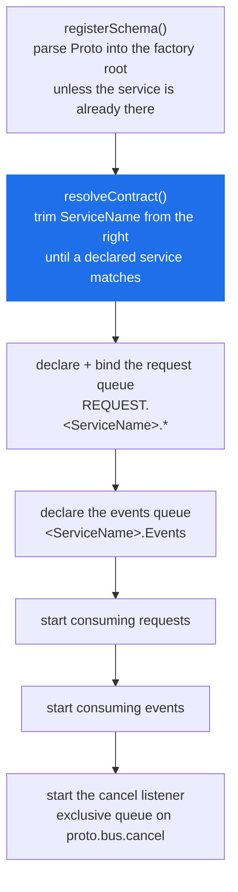
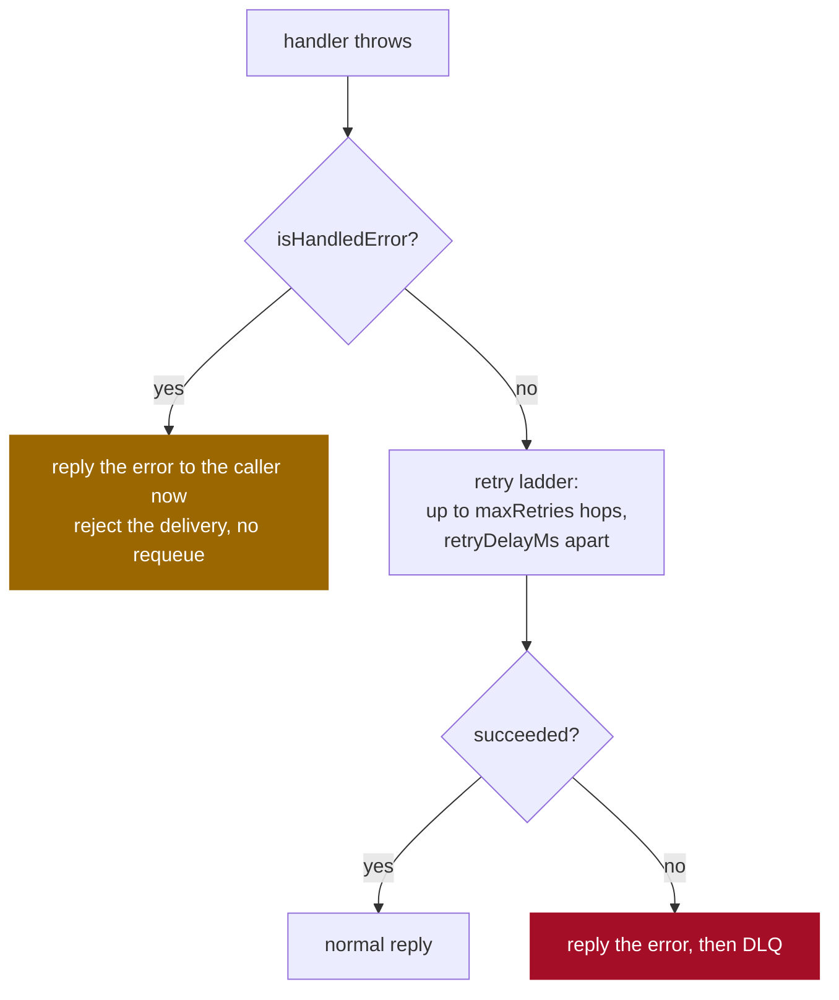

# MessageService

> The base class a service extends. It declares the service's queue, routes each request to one of your methods, and carries the event publish/subscribe pair.

**Read this if** you are writing a service class, or a caller is getting `invalid service method` for a method you can see on the class.

| | |
|---|---|
| **Prerequisites** | [Getting Started](../../guide/getting-started.md) · [Context](./context.md) |
| **Next** | [RunnableService](./runnable-service.md) · [Error Handling](../../guide/error-handling.md) · [Events](../../guide/events.md) |
| **Source** | [`lib/message_service.ts`](../../../lib/message_service.ts) · [`lib/message_listener.ts`](../../../lib/message_listener.ts) · [`lib/event_listener.ts`](../../../lib/event_listener.ts) |

**On this page** — [The class](#the-class) · [Required members](#required-members) · [Constructor options](#constructor-options) · [What init does](#what-init-does) · [The handler contract](#the-handler-contract) · [Instance names](#instance-names-and-the-contract-they-resolve-to) · [Events](#events) · [When a handler throws](#when-a-handler-throws) · [Shutdown](#shutdown) · [Startup errors](#startup-errors)

---

## The class

```typescript
abstract class MessageService implements IMessageService {
    constructor(context: IContext, options?: IMessageServiceOptions);

    abstract get ServiceName(): string;
    abstract get ProtoFileName(): string;
    get Proto(): string;                       // reads ProtoFileName off disk

    init(): Promise<void>;
    stopConsuming(): Promise<void>;

    publishEvent(type: string, content: any, topic?: any): Promise<any>;
    subscribeEvent(type: string, handler: EventHandler, topic?: string): Promise<any>;

    protected context: IContext;
}
```

> [!IMPORTANT]
> `MessageService` extends **nothing**. Earlier versions of this page said it extends `BaseListener`; it does not, and never has ([`lib/message_service.ts`](../../../lib/message_service.ts) line 83). It *owns* three listeners as private fields — a `MessageListener` for the request queue, an `EventListener` for the events queue and a `CancelListener` for stream cancellations — which is why none of their members appear on your subclass.

That listing is the entire public surface. In particular there is no `onInitialized`, no `onBeforeStart`, and no `cleanup()` — earlier versions of this page documented all three as lifecycle hooks and overriding them does nothing. `cleanup()` is real, but it belongs to [`RunnableService`](./runnable-service.md#cleanup).

---

## Required members

### `ServiceName`

The name the service is addressed by. It binds `REQUEST.<ServiceName>.*` on `proto.bus`, and its events queue is `<ServiceName>.Events`.

It is normally `<Package>.<Service>` exactly as the `.proto` declares it, but it may carry extra segments — see [Instance names](#instance-names-and-the-contract-they-resolve-to).

### `ProtoFileName`

A path to the `.proto` file declaring this service. The default `Proto` getter does `fs.existsSync(this.ProtoFileName)` and throws `MissingProto('missing_proto_source')` if it is not there.

> [!WARNING]
> A relative path is resolved against the **process working directory**, not against the source file. `__dirname + '/calculator.proto'` is reliable; `'./calculator.proto'` breaks the moment the service is started from anywhere else.

[`RunnableService`](./runnable-service.md#protofilename) supplies this getter by convention, so a subclass of that one only has to declare `ServiceName`.

### The schema must declare a `service` block

`init()` looks the service up in the loaded schema and reads its declared method names. A `.proto` with only messages in it is not enough.

> [!NOTE]
> This holds even for a service that implements **no RPCs at all** and exists only to subscribe to events. Without a `service` block, `init()` throws `MissingProto` with `no service in the schema matches '<name>' or any prefix of it`. An empty `service Subscriber {}` satisfies it.

---

## Constructor options

`IMessageServiceOptions`, all optional, all passed to the constructor. None of them is an overridable property.

| Option | Type | Default | What it does |
|---|---|---|---|
| `maxConcurrent` | `number` | `1` (`DEFAULT_PREFETCH`) | Consumer prefetch: unacked messages this replica holds at once. |
| `retry.maxRetries` | `number` | `3` | Redelivery attempts before the DLQ. `0` disables retries. |
| `retry.retryDelayMs` | `number` | `5000` | Becomes the retry queue's `x-message-ttl`. |
| `retry.messageTtlMs` | `number` | unset | TTL on the main queue. Unset means no expiry. |
| `lateAck` | `boolean` | `true` | Ack after the handler returns. |
| `processingTimeoutMs` | `number` | `Config.messageProcessingTimeout` (`MESSAGE_PROCESSING_TIMEOUT`, 600000) | How long one handler may run before the delivery is abandoned. |
| `maxPriority` | `number` | unset | Declares the request queue as a RabbitMQ priority queue with `x-max-priority`. Integer 1-255. |

<!-- doc-check: compile id=ms-service -->
```typescript
// src/calculator-service.ts
import { MessageService, IContext } from 'protobus';

export class CalculatorService extends MessageService {
    public get ServiceName(): string { return 'Calculator.Math'; }
    public get ProtoFileName(): string { return __dirname + '/proto/Calculator.proto'; }

    async add(request: { a: number; b: number }): Promise<{ result: number }> {
        return { result: request.a + request.b };
    }
}

export function build(context: IContext): CalculatorService {
    return new CalculatorService(context, {
        maxConcurrent: 10,
        retry: { maxRetries: 5, retryDelayMs: 2000 },
    });
}
```

> [!CAUTION]
> **`maxConcurrent` defaults to `1`.** One message at a time per replica, the slot held until the handler returns and its reply is away. A service that awaits any I/O and was never configured is leaving nearly all of its throughput unused. A *streaming* handler holds its slot for the whole life of the stream, so a streaming service left on the default serves one caller per replica. Full detail in [Configuration → Concurrency](../configuration.md#concurrency).

> [!WARNING]
> **`lateAck: false` is not a performance setting.** Acking on delivery disables the retry, DLQ and error-reply paths entirely: a failed message is dropped and the caller waits out its full `RPC_CALL_TIMEOUT_MS` for a reply that is never published. Use it only for genuine at-most-once delivery with no error reporting.

> [!WARNING]
> **`maxPriority` cannot be added to a queue that already exists.** RabbitMQ fixes queue arguments at declare time, so the changed declare fails with `PRECONDITION_FAILED` and `init()` rejects — the service does not start. An operator has to drain and delete the main queue first. Read [Message Priority → Enabling priority on a queue that already exists](../../guide/priority.md#-enabling-priority-on-a-queue-that-already-exists) before turning it on. The floor is `1`, not `0`: `x-max-priority: 0` is a plain queue with a priority queue's overhead, so it is refused ([`lib/priority.ts`](../../../lib/priority.ts), `validateMaxPriority`).

---

## What `init()` does



Everything after `resolveContract()` touches the broker, so a schema problem surfaces before any queue is declared. A failure at any step is logged with the service name and rethrown.

> [!NOTE]
> The service registers its own schema, so passing a proto directory to `Context.init()` is optional. When you do both, the second registration is a no-op rather than a protobufjs `duplicate name` error — the factory keys on the service name *and* on the schema text.

---

## The handler contract

An RPC method is a method on your subclass whose name matches an `rpc` in the contract. It receives four arguments:

| # | Parameter | Type | Notes |
|---|---|---|---|
| 1 | `request` | your request message | already decoded against the contract's schema |
| 2 | `actor` | `string \| undefined` | caller-supplied and **unverified** |
| 3 | `correlationId` | `string \| undefined` | the delivery's correlation id, for logging |
| 4 | `context` | `MessageHandlerContext \| undefined` | `{ signal, routingKey, messageId?, redelivered }` |

Earlier versions of this page listed only the first three. The fourth is what a long-running or streaming handler needs.

<!-- doc-check: compile -->
```typescript
import { MessageService } from 'protobus';

// MessageHandlerContext is not re-exported from the package index, so the
// shape is written out here. It lives in lib/connection.ts.
interface HandlerContext {
    signal: AbortSignal;
    routingKey: string;
    messageId?: string;
    redelivered: boolean;
}

export class ReportService extends MessageService {
    public get ServiceName(): string { return 'Reports.Service'; }
    public get ProtoFileName(): string { return __dirname + '/proto/Reports.proto'; }

    async generate(
        request: { rows: number },
        actor?: string,
        correlationId?: string,
        context?: HandlerContext,
    ): Promise<{ written: number }> {
        if (context?.redelivered) {
            // This exact message has been delivered before. messageId is stable
            // across every retry hop, so it is what deduplication keys on.
            console.warn(`redelivery of ${context.messageId} for ${actor}`);
        }

        let written = 0;
        for (let i = 0; i < request.rows; i++) {
            // The signal fires on the processing timeout and on caller
            // cancellation. Nothing preempts a running function, so a handler
            // that never checks it simply runs to the end.
            if (context?.signal?.aborted) break;
            written++;
        }
        return { written };
    }
}
```

> [!WARNING]
> **`actor` is not authentication.** The caller sets it and nothing signs or verifies it — any process that can publish to the bus can publish any value. Use it for tracing and audit logging, never to decide whether an operation is permitted. Identity is enforced with per-service broker credentials: [Security model](../../operations/security.md).

### Only methods your subclass defines are dispatchable

The lookup walks the prototype chain and **stops at `MessageService.prototype`** ([`lib/message_service.ts`](../../../lib/message_service.ts), `resolveOwnHandler`). A plain `this[name]` lookup would resolve an rpc named `init` or `publishEvent` to the framework's own member and call it with the caller's arguments; instead such a name resolves to nothing and the caller gets `invalid service method`.

If a method is on the class and calls still fail, work down this ladder — it is the order `_onMessage` checks in, and each step has a distinct message:

| Check | Rejected with |
|---|---|
| the envelope decodes | `request envelope did not decode` |
| the routing key starts with `REQUEST.<ServiceName>.` | `routing key … does not belong to service …` |
| the body's method matches the routing key's last segment | `request method … contradicts routing key …` |
| the body names a method of *this* contract, spelled in full | `request method … is not a method of …` |
| the contract declares that method | `… declares no method …` |
| your subclass implements it | `invalid service method …` |
| the payload decodes as that method's request type | `payload did not decode as the request type of …` |

<details>
<summary><b>Why the routing key is checked against the body at all</b></summary>

<br/>

The method to run comes out of the message body, which is publisher-controlled. Without the cross-check, a client that can publish to the bus picks which method executes regardless of the routing key it was permitted to publish on — which makes RabbitMQ topic permissions unenforceable, and lets one service's request schema be paired with another service's handler.

The envelope is decoded and checked *before* the payload, because the method name selects the schema the payload is read with.

</details>

### Streaming methods

A method the `.proto` declares `returns (stream …)` must be an async generator returning `AsyncIterable<chunk>`. Returning a promise instead fails the call with `streaming method <name> must return an AsyncIterable`. See [Streaming](../../guide/streaming.md#server-api).

---

## Instance names and the contract they resolve to

`ServiceName` does not have to be the name the `.proto` declares. `resolveContract()` trims dot-separated segments off the right until one matches a `service` in the schema:


This is how several replicas share one schema while each owns a distinct queue: `Combat.Player.player6` binds `REQUEST.Combat.Player.player6.*` and gets its own `Combat.Player.player6.Events`, but its methods and payload types come from `service Player`. [`sample/combatGame`](../../../sample/combatGame) gives every player its own name this way.

Two consequences that are easy to trip over:

> [!IMPORTANT]
> **`ServiceProxy` does not do this trimming.** It looks the name up verbatim, so there is no way to build a proxy for `Combat.Player.player6`. Addressing an instance-named service means building the routing key by hand and calling [`context.publishMessage`](./context.md#publishmessagecontent-routingkey-rpc-timeoutms-options) — encode against the contract name, route against the instance name.

> [!NOTE]
> Trimming stops at the first segment. `Combat.Player.player6` will never resolve against a bare `Combat`, and a name with no dot that is not itself a declared service throws immediately.

---

## Events

### `publishEvent(type, content, topic?)`

| Parameter | Description |
|---|---|
| `type` | fully-qualified message type from the schema, e.g. `Calculator.CalculationEvent` |
| `content` | plain object matching that message |
| `topic` | routing key; omitted or falsy means `EVENT.<type>` |

Publishing does not require the event's type to belong to this service's schema — any type in the factory root will do.

### `subscribeEvent(type, handler, topic?)`

The handler is `(event, type, topic) => Promise<void>`. `topic` is a RabbitMQ topic pattern; omitted, it binds `EVENT.<type>`.

> [!IMPORTANT]
> **Subscribe after `init()`, never before.** `subscribeEvent` binds a queue using the channel and queue name that `init()` creates, so calling it on a service that has not been initialised fails on an undefined channel.

<!-- doc-check: compile needs=ms-service -->
```typescript
import { IContext } from 'protobus';
import { CalculatorService } from './calculator-service';

async function main(context: IContext) {
    const service = new CalculatorService(context);
    await service.init();          // first

    await service.subscribeEvent('Audit.LogEvent', async (event, type, topic) => {
        console.log(`${type} on ${topic}`, event);
    });

    // Wildcards are RabbitMQ topic patterns: * is one segment, # is any number.
    await service.subscribeEvent('Orders.OrderEvent', async (event) => {
        console.log('a US order shipped', event);
    }, 'ORDERS.US.*');
}
```

The events queue is `<ServiceName>.Events`: **durable and not auto-delete**. Events published while every replica is down are still there when one comes back — and an events queue belonging to a service you deleted keeps filling forever. See [Queue Migration](../../operations/queue-migration.md).

> [!NOTE]
> There is no `unsubscribe`. The topic trie has no removal path ([`lib/event_listener.ts`](../../../lib/event_listener.ts)). A subscription lasts for the life of the process.

Wildcards, competing subscribers and delivery semantics: [Events](../../guide/events.md).

---

## When a handler throws

The two paths are not variations on each other; they differ in when the caller hears anything.



> [!WARNING]
> **A plain `Error` does not reach the caller immediately.** No reply is published while a message is being retried. At the defaults — `maxRetries: 3`, `retryDelayMs: 5000` — a permanently failing call blocks its caller for roughly 15 seconds before the error arrives. Size `RPC_CALL_TIMEOUT_MS` against `maxRetries × retryDelayMs`, not against one handler run.

`HandledError` is the way to say "this is a business outcome, not an infrastructure failure". Its `message` and `code` always cross the wire, and it is never retried.

<!-- doc-check: compile -->
```typescript
import { MessageService, HandledError } from 'protobus';

class NotFoundError extends HandledError {
    constructor(id: string) { super(`order ${id} not found`, 'NOT_FOUND'); }
}

export class OrderService extends MessageService {
    public get ServiceName(): string { return 'Orders.Service'; }
    public get ProtoFileName(): string { return __dirname + '/proto/Orders.proto'; }

    async get(request: { orderId: string }): Promise<{ total: number }> {
        if (!request.orderId) {
            // Answered at once. Retrying a request with no id cannot help.
            throw new HandledError('orderId is required', 'VALIDATION_ERROR');
        }

        const order = await this.load(request.orderId);
        if (!order) throw new NotFoundError(request.orderId);

        // A throw from here — a dropped database connection, say — is an
        // infrastructure failure and DOES go round the retry ladder.
        return { total: order.total };
    }

    private async load(_id: string): Promise<{ total: number } | null> {
        return { total: 0 };
    }
}
```

An unhandled error's message is sanitized before it is sent to the caller unless `PROTOBUS_EXPOSE_INTERNAL_ERRORS=false`; the unsanitized error still goes to this service's own log. Full treatment in [Error Handling](../../guide/error-handling.md) and [Errors](../errors.md).

---

## Shutdown

`stopConsuming()` stops the request and event consumers and closes the cancel listener, leaving channels open so work already in hand can finish. It is the first step of a graceful shutdown, not the whole of it.

<!-- doc-check: compile needs=ms-service -->
```typescript
import { IContext } from 'protobus';
import { CalculatorService } from './calculator-service';

async function shutdown(context: IContext, service: CalculatorService) {
    await service.stopConsuming();                    // no new work
    await context.connection.drainInFlight(30000);    // let current work finish
    await context.connection.disconnect();            // then close the socket
}
```

[`RunnableService.start`](./runnable-service.md#runnableservicestartcontext-serviceclass-options-postinit) does exactly this on SIGINT/SIGTERM, with a `cleanup()` hook between the drain and the disconnect. Use it unless something else owns the process lifecycle.

---

## Startup errors

| Thrown | Meaning | Fix |
|---|---|---|
| `MissingProto('missing_proto_source')` | `ProtoFileName` does not exist as a file | use an absolute path; check the process working directory |
| `MissingProto('no service in the schema matches …')` | the schema loaded but declares no matching `service` block, at any prefix | add the `service` block, or correct `ServiceName` |
| `RetryQueueMismatchError` | `retryDelayMs` changed on a service whose retry queue already exists | drain and delete `<Service>.Retry`, or keep the old value |
| `InvalidPriorityError` | `maxPriority` is not an integer 1-255 | see [Message Priority](../../guide/priority.md) |
| `PRECONDITION_FAILED` on `queue.declare` | `maxPriority` added to an existing queue | [Queue Migration](../../operations/queue-migration.md) |

Full catalogue with the exact messages: [Errors](../errors.md#startup-errors).

---

<div align="center">

**[← Context](./context.md)** · **[Docs index](../../README.md)** · **[RunnableService →](./runnable-service.md)**

</div>
