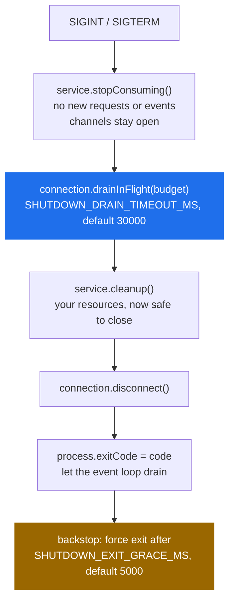

# RunnableService

> `MessageService` plus the process it runs in: a proto filename by convention, signal handling, an ordered drain on shutdown, and a non-zero exit when startup fails.

**Read this if** you are writing the entry point of a service process, or an orchestrator is reporting a service that failed to boot as a clean exit.

| | |
|---|---|
| **Prerequisites** | [MessageService](./message-service.md) — everything there applies here |
| **Next** | [ServiceProxy](./service-proxy.md) · [Patterns](../../guide/patterns.md) · [Configuration](../configuration.md) |
| **Source** | [`lib/runnable_service.ts`](../../../lib/runnable_service.ts) · [`lib/message_service.ts`](../../../lib/message_service.ts) · [`lib/connection.ts`](../../../lib/connection.ts) |

**On this page** — [What it adds](#what-it-adds) · [ProtoFileName](#protofilename) · [cleanup](#cleanup) · [start](#runnableservicestartcontext-serviceclass-options-postinit) · [The shutdown sequence](#the-shutdown-sequence) · [Exit codes](#exit-codes) · [When to use which](#when-to-use-which)

---

## What it adds

`RunnableService` is an abstract subclass of [`MessageService`](./message-service.md) with the same constructor. Four additions, and nothing else:

| Addition | Kind | Effect |
|---|---|---|
| `ProtoFileName` | concrete getter | derived from `ServiceName`, so a subclass declares only `ServiceName` |
| `cleanup()` | protected hook | a no-op you override; called during shutdown |
| `RunnableService.start()` | static | construct, `init()`, install signal handlers, return the instance |
| the shutdown sequence | behaviour | stop consuming, drain, clean up, disconnect, exit |

Everything else — `init()`, `publishEvent`, `subscribeEvent`, `stopConsuming()`, the handler contract, the retry ladder — is inherited unchanged from [`MessageService`](./message-service.md).

<!-- doc-check: compile id=rs-service -->
```typescript
// src/calculator-service.ts
import { RunnableService } from 'protobus';

export class CalculatorService extends RunnableService {
    // The only required member. ProtoFileName comes by convention.
    public get ServiceName(): string { return 'Calculator.Math'; }

    async add(request: { a: number; b: number }): Promise<{ result: number }> {
        return { result: request.a + request.b };
    }
}
```

---

## `ProtoFileName`

<!-- doc-check: ignore why="quoted verbatim from lib/runnable_service.ts, a method body outside any class" -->
```typescript
public get ProtoFileName(): string {
    const packageName = this.ServiceName.split('.')[0] || this.ServiceName;
    return `${packageName}.proto`;
}
```

The rule is the **first** dot-separated segment — the package — plus `.proto`. It is not "the service name with the last segment replaced", which is what the derivation looks like on a two-segment name and is not what it does on any other.

| `ServiceName` | `ProtoFileName` |
|---|---|
| `Calculator.Math` | `Calculator.proto` |
| `Notifications.Service` | `Notifications.proto` |
| `Combat.Player.player6` | `Combat.proto` |
| `Orders` | `Orders.proto` |

> [!WARNING]
> The result is a **bare relative filename**, resolved against the process working directory. `Calculator.proto` means `./Calculator.proto` as seen by whoever started the process — not a path relative to the source file. A service that runs from the repo root and fails from `dist/` is hitting this, and the error is only `MissingProto: missing_proto_source`.

Two ways out. Either pass the proto directory to [`Context.init()`](./context.md#initamqpurl-protolocations-options), which loads the schema before the service's own `Proto` getter is ever consulted:

<!-- doc-check: compile -->
```typescript
import { Context } from 'protobus';

async function main() {
    const context = new Context();
    // The schema is in the root before any service asks for it, so the
    // convention-derived filename is never read from disk.
    await context.init('amqp://localhost', [__dirname + '/proto/']);
}
```

Or override the getter with an absolute path:

<!-- doc-check: compile -->
```typescript
import { RunnableService } from 'protobus';
import * as path from 'path';

export class ReportService extends RunnableService {
    public get ServiceName(): string { return 'Reports.Service'; }

    // Absolute, and relative to this file rather than to the process.
    public get ProtoFileName(): string {
        return path.join(__dirname, 'proto', 'Reports.proto');
    }
}
```

---

## `cleanup()`

<!-- doc-check: ignore why="the static signature as declared, not a call site" -->
```typescript
protected async cleanup(): Promise<void>
```

A no-op you override to release resources the framework knows nothing about. It runs **after** consumers have stopped and in-flight work has drained, so a request can never arrive after you have closed a database handle.

<!-- doc-check: compile -->
```typescript
import { RunnableService } from 'protobus';

interface Pool { end(): Promise<void>; }

export class OrderService extends RunnableService {
    private pool: Pool;

    public get ServiceName(): string { return 'Orders.Service'; }

    async create(request: { total: number }): Promise<{ id: string }> {
        return { id: String(request.total) };
    }

    protected async cleanup(): Promise<void> {
        await this.pool.end();
    }
}
```

> [!NOTE]
> A throw from `cleanup()` is caught and logged; it does not abort the shutdown or change the exit code. The connection is closed either way.

---

## `RunnableService.start(context, ServiceClass, options?, postInit?)`

<!-- doc-check: ignore why="a protected member signature, not a standalone snippet" -->
```typescript
static async start<T extends RunnableService>(
    context: IContext,
    ServiceClass: new (context: IContext, options?: IMessageServiceOptions) => T,
    options?: IMessageServiceOptions,
    postInit?: (service: T) => Promise<void>,
): Promise<T>
```

| Parameter | Description |
|---|---|
| `context` | an **already initialised** context. `start()` does not call `context.init()`. |
| `ServiceClass` | the class itself, not an instance. Must extend `RunnableService`. |
| `options` | `IMessageServiceOptions`, forwarded to the constructor — see [Constructor options](./message-service.md#constructor-options) |
| `postInit` | runs after `init()` and before the "Service ready" log. A throw here takes the startup-failure path. |

Returns the constructed service.

<!-- doc-check: compile needs=rs-service -->
```typescript
// src/server.ts
import { RunnableService, Context } from 'protobus';
import { CalculatorService } from './calculator-service';

async function main() {
    const context = new Context();
    await context.init(process.env.AMQP_URL || 'amqp://localhost', [__dirname + '/proto/']);

    await RunnableService.start(
        context,
        CalculatorService,
        { maxConcurrent: 10 },
        async (service) => {
            await service.subscribeEvent('Audit.LogEvent', async (event) => {
                console.log('audit', event);
            });
        },
    );

    console.log('Calculator service is running');
}

main().catch((error) => {
    console.error(error);
    process.exit(1);
});
```

> [!IMPORTANT]
> **`start()` only accepts a class extending `RunnableService`.** Passing a plain `MessageService` subclass is a compile error — `Property 'cleanup' is missing in type 'X' but required in type 'RunnableService'` — because the type parameter is `T extends RunnableService`. If you want the lifecycle, change the base class; there is no overload that takes a `MessageService`.

> [!TIP]
> `postInit` is where event subscriptions belong. `subscribeEvent` needs the channel and queue that `init()` creates, so it cannot run any earlier, and `postInit` is the first callback after `init()` resolves.

Signal handlers are registered with `process.once`, not `process.on`, so one call to `start()` contributes exactly one shutdown per signal. Two services started in the same process each register their own handler and each shut themselves down once.

---

## The shutdown sequence

SIGINT (Ctrl-C) and SIGTERM (a container stop) both run this. It is re-entrant-guarded, so a second signal during shutdown is ignored.



The order is load-bearing at every step:

- **Stop before drain.** `cleanup()` running while consumers still deliver means a request can arrive after your resources are closed.
- **Drain before cleanup.** The drain waits for the reply, retry or DLQ publish that *settles* each in-flight message, not merely for the handler to return.
- **The drain is bounded.** If the budget expires, the remaining deliveries stay unacknowledged and RabbitMQ redelivers them to another replica. The log says so explicitly: `Drain deadline reached with N still running; they stay unacknowledged and will be redelivered`.
- **`process.exit()` is not called on the happy path.** `process.exitCode` is set and the loop is allowed to drain, so pending stdout writes are not truncated. The forced exit is a backstop with an `unref`'d timer, so it never keeps an otherwise-finished process alive.

> [!NOTE]
> Earlier versions of this page described the sequence as "cleanup, then `context.shutdown()`, then exit 0". There is no `context.shutdown()` — the connection is closed with `context.connection.disconnect()` — cleanup is third rather than first, and the exit code is not always 0.

---

## Exit codes

| Situation | `process.exitCode` |
|---|---|
| SIGINT or SIGTERM | `0` |
| `new ServiceClass(...)`, `init()` or `postInit` threw | `1` |

> [!IMPORTANT]
> The non-zero exit on a failed startup is the point. Exiting 0 tells Kubernetes and systemd the process succeeded, so a service that could not start is never restarted and never alerts. On that path `start()` also removes its signal handlers, runs the full shutdown with code 1, and rethrows — so your own `main().catch(...)` still sees the original error.

---

## When to use which

| | `MessageService` | `RunnableService` |
|---|---|---|
| `ProtoFileName` | you implement it | derived from `ServiceName`, overridable |
| SIGINT / SIGTERM | you install handlers | installed by `start()` |
| Drain on shutdown | you call `stopConsuming()` + `drainInFlight()` | ordered for you |
| Cleanup hook | none | `cleanup()` |
| Bootstrap helper | none | `start()` |
| Exit code on boot failure | yours to set | `1` |

Use `RunnableService` for anything that owns its process — which is most services. Use `MessageService` when something else owns the lifecycle: a test harness, a DI container, or a process running several services where you want one shutdown path rather than one per service.

<details>
<summary><b>Running a RunnableService without <code>start()</code></b></summary>

<br/>

Nothing forces you through `start()`. Constructing and calling `init()` yourself gives you the convention-based `ProtoFileName` and the `cleanup()` hook without the signal handling — you then own the ordering described above.

<!-- doc-check: compile needs=rs-service -->
```typescript
import { IContext } from 'protobus';
import { CalculatorService } from './calculator-service';

async function run(context: IContext) {
    const service = new CalculatorService(context, { maxConcurrent: 4 });
    await service.init();

    // ... and on the way out, in this order:
    await service.stopConsuming();
    await context.connection.drainInFlight(30000);
    await context.connection.disconnect();
}
```

`cleanup()` is `protected`, so an external shutdown path cannot call it — put the teardown in your own method, or go through `start()`.

</details>

---

<div align="center">

**[← MessageService](./message-service.md)** · **[Docs index](../../README.md)** · **[ServiceProxy →](./service-proxy.md)**

</div>
