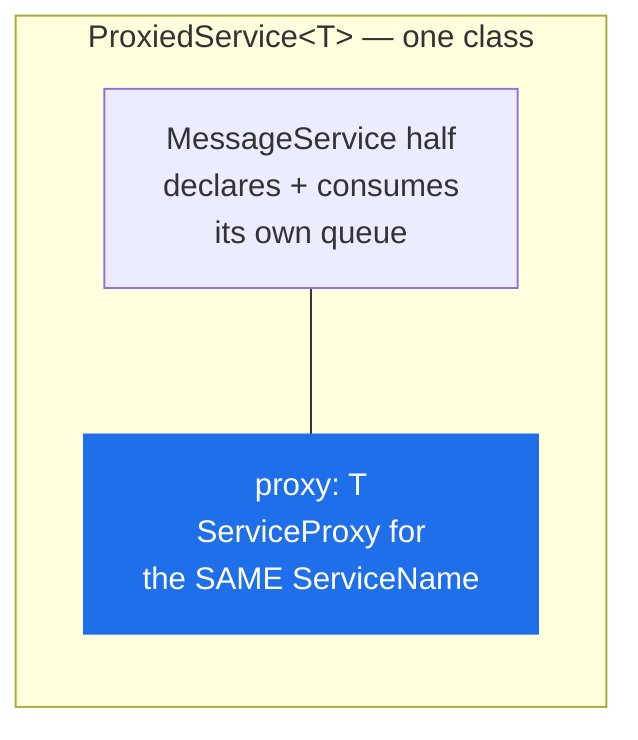

# ServiceProxy

> A client for one remote service. At `init()` it reads that service's contract out of the loaded schema and installs one stub per `rpc`.

**Read this if** you are calling a service, or TypeScript is refusing a method you can see in the `.proto`.

| | |
|---|---|
| **Prerequisites** | [Context](./context.md) — an initialised context with the schema loaded |
| **Next** | [Errors](../errors.md) · [Streaming](../../guide/streaming.md) · [Message Priority](../../guide/priority.md) |
| **Source** | [`lib/service_proxy.ts`](../../../lib/service_proxy.ts) · [`lib/message_dispatcher.ts`](../../../lib/message_dispatcher.ts) · [`lib/proxied_service.ts`](../../../lib/proxied_service.ts) |

**On this page** — [The class](#the-class) · [Typing the call sites](#typing-the-call-sites) · [Unary calls](#unary-calls) · [Streaming calls](#streaming-calls) · [Timeouts](#timeouts) · [Errors](#errors) · [ProxiedService](#proxiedservicet) · [Instance names](#instance-names)

---

## The class

<!-- doc-check: ignore why="the declared shape of the class, not a standalone snippet: it names IContext without importing it" -->
```typescript
class ServiceProxy {
    constructor(context: IContext, serviceName: string);
    init(): Promise<void>;
}
```

That is the whole of the declared surface. The methods you actually call are assigned onto the instance during `init()`, one per `rpc` in the contract.

> [!IMPORTANT]
> **`ServiceProxy` has no index signature.** `proxy.add(...)` does not type-check, and no amount of `init()` changes that — the stubs exist at runtime and are invisible to the compiler. This is a real limitation of the class, not a style preference. See [Typing the call sites](#typing-the-call-sites).

> [!NOTE]
> There is no `IServiceProxy`. Earlier versions of this page opened with `import { ServiceProxy, IServiceProxy } from 'protobus'`, which does not resolve — no such interface is exported, or defined anywhere in the library.

### `init()`

`init()` looks `serviceName` up in the context's proto root and installs a stub for every method the contract declares. It does **not** set up the callback listener: the reply queue belongs to the context's `MessageDispatcher` and was created by [`Context.init()`](./context.md#initamqpurl-protolocations-options).

| Condition | Result |
|---|---|
| called twice on one instance | `AlreadyInitializedError` |
| `serviceName` is not a service in the loaded schema | protobufjs `Error: no such Service '<name>' in Root` |
| a proto method's name collides with a `ServiceProxy` member | `InvalidServiceNameError`, naming the method |

The collision check exists because the stubs are assigned straight onto the instance: an `rpc` named `init`, `context` or `serviceName` would silently clobber the proxy's own member. It fails loudly at `init()` instead, telling you to rename the method in the `.proto`.

---

## Typing the call sites

Two honest forms. Both are in the repo.

**Preferred — intersect with an interface.** The call site stays type-checked, and `npx protobus generate` writes the interface for you.

<!-- doc-check: compile id=sp-client -->
```typescript
import { Context, ServiceProxy } from 'protobus';

export interface CalculatorMath {
    add(request: { a: number; b: number }, actor?: string): Promise<{ result: number }>;
    divide(request: { a: number; b: number }, actor?: string): Promise<{ result: number }>;
}

export async function main() {
    const context = new Context();
    await context.init(process.env.AMQP_URL || 'amqp://localhost', [__dirname + '/proto/']);

    const calculator = new ServiceProxy(context, 'Calculator.Math') as ServiceProxy & CalculatorMath;
    await calculator.init();

    const { result } = await calculator.add({ a: 10, b: 20 });
    console.log(`10 + 20 = ${result}`);

    // A client that does not disconnect never exits: the open AMQP socket and
    // its heartbeat timer hold the event loop open.
    await context.connection.disconnect();
}
```

**Blunter — `any`.** What [`sample/tokenStream/StreamingDemo.ts`](../../../sample/tokenStream/StreamingDemo.ts) does. One line shorter, and every call site unchecked.

<!-- doc-check: compile -->
```typescript
import { IContext, ServiceProxy } from 'protobus';

async function connect(context: IContext) {
    const assistant: any = new ServiceProxy(context, 'Chat.Assistant');
    await assistant.init();
    return assistant;
}
```

> [!TIP]
> Keep the `ServiceProxy &` half of the intersection. Casting to the bare interface loses `init()`, and you need it.

---

## Unary calls

<!-- doc-check: ignore why="the shape of a generated unary stub, which exists only at runtime and has no standalone declaration" -->
```typescript
methodName(
    request: RequestType,
    actor?: string,
    rpc?: boolean,
    timeoutMs?: number,
    options?: CallOptions,
): Promise<ResponseType>
```

| Parameter | Default | Behaviour |
|---|---|---|
| `request` | — | plain object matching the request message |
| `actor` | `undefined` | caller-supplied string, forwarded verbatim to the handler. **Not authenticated.** |
| `rpc` | `true` | `false` means fire-and-forget: publish and do not wait |
| `timeoutMs` | `Config.rpcCallTimeoutMs` (`RPC_CALL_TIMEOUT_MS`, 600000) | rejects with `RpcTimeoutError` |
| `options.priority` | unset | AMQP priority, integer 0-255 |
| `options.messageId` | a fresh UUID | the message identity the consumer sees. Set it to make a caller-driven republish recognisable after an ambiguous outcome — see [Deduplicating a caller own republish](../../concepts/delivery-guarantees.md#deduplicating-a-callers-own-republish). Blank is refused with `InvalidMessageIdError` |

> [!WARNING]
> **With `rpc: false` the returned promise resolves with `{}`**, not with the service's response. Nothing is waited for and nothing is decoded. Destructuring the result of a fire-and-forget call gives you `undefined` for every field, silently.

<!-- doc-check: compile -->
```typescript
import { IContext, ServiceProxy, Config } from 'protobus';

interface AuditService {
    record(
        request: { event: string },
        actor?: string,
        rpc?: boolean,
        timeoutMs?: number,
        options?: { priority?: number },
    ): Promise<any>;
}

async function main(context: IContext) {
    const audit = new ServiceProxy(context, 'Audit.Service') as ServiceProxy & AuditService;
    await audit.init();

    // Fire-and-forget: resolves once the broker confirms the publish. The
    // resolved value is {} — there is no reply to decode.
    await audit.record({ event: 'login' }, 'user-123', false);

    // A control message that should overtake a bulk backlog. Only has an
    // effect on a queue the service declared with maxPriority.
    await audit.record(
        { event: 'shutdown' }, 'ops', true, 5000,
        { priority: Config.PRIORITY_CONTROL },
    );
}
```

`options.priority` only changes delivery order on a queue whose service declared `maxPriority`; on any other queue the broker ignores it without error, which is what lets an upgraded caller talk to a service that has not been upgraded. Prefer the named levels — `Config.PRIORITY_NORMAL` (0), `Config.PRIORITY_HIGH` (1), `Config.PRIORITY_CONTROL` (2) — over bare integers. See [Message Priority](../../guide/priority.md).

> [!NOTE]
> An RPC publish is `mandatory`, so a call to a service with nothing bound to its routing key fails at once with `UnroutableError` rather than after the full 10-minute timeout.

---

## Streaming calls

A method the `.proto` declares as `returns (stream …)` gets a different stub, decided at `init()` from the schema:

<!-- doc-check: ignore why="the shape of a generated streaming stub, which exists only at runtime and has no standalone declaration" -->
```typescript
methodName(
    request: RequestType,
    actor?: string,
    idleTimeoutMs?: number,
    options?: StreamOptions,
): AsyncIterable<ChunkType>
```

It is **not** `async` — there is no promise to await before the `for await`, and the third and fourth parameters are not the unary ones. `idleTimeoutMs` defaults to `Config.streamIdleTimeoutMs` (`STREAM_IDLE_TIMEOUT_MS`, 60000) and bounds the gap *between* chunks, not the stream's total duration.

<!-- doc-check: compile -->
```typescript
import { IContext, ServiceProxy, StreamOptions } from 'protobus';

interface ChatAssistant {
    generate(
        request: { prompt: string },
        actor?: string,
        idleTimeoutMs?: number,
        options?: StreamOptions,
    ): AsyncIterable<{ index: number; text: string }>;
}

async function main(context: IContext) {
    const assistant = new ServiceProxy(context, 'Chat.Assistant') as ServiceProxy & ChatAssistant;
    await assistant.init();

    const stop = new AbortController();

    // No await on the call itself; the AsyncIterable is returned synchronously.
    for await (const token of assistant.generate(
        { prompt: 'hello' }, 'user-123', 30000, { signal: stop.signal },
    )) {
        process.stdout.write(token.text);
    }
}
```

> [!NOTE]
> `StreamOptions` declares `priority?: never` on purpose. Priority is not supported on streaming calls, and the declaration makes passing one a type error rather than a silent drop — the two option objects sit in different argument slots and are easy to confuse at a call site.

Cancellation, backpressure and the wire protocol: [Streaming](../../guide/streaming.md).

---

## Timeouts

> [!IMPORTANT]
> A caller's timeout is **`RPC_CALL_TIMEOUT_MS`**, default `600000` (10 minutes). It is not `MESSAGE_PROCESSING_TIMEOUT`, which earlier versions of this page named. The two are separate settings with separate defaults that happen to coincide.

| Setting | Applies to | Default | Raised as |
|---|---|---|---|
| `RPC_CALL_TIMEOUT_MS` | the **caller** waiting for a reply | 600000 | `RpcTimeoutError` |
| `MESSAGE_PROCESSING_TIMEOUT` | the **server** handler's own run | 600000 | delivery abandoned, handler's `signal` aborts |
| `STREAM_IDLE_TIMEOUT_MS` | the gap between streaming chunks | 60000 | `StreamTimeoutError` |

Setting `MESSAGE_PROCESSING_TIMEOUT=30000` does nothing whatsoever to how long your client waits.

```bash
export RPC_CALL_TIMEOUT_MS=30000   # every caller in this process waits 30s
```

Per call, pass `timeoutMs` as the fourth argument. Size it against the retry ladder, not against one handler run: no reply is published while a message is being retried, so at the service's defaults (`maxRetries: 3`, `retryDelayMs: 5000`) a permanently failing call takes roughly 15 seconds to produce its error.

<!-- doc-check: compile -->
```typescript
import { IContext, ServiceProxy, CallOptions, RpcTimeoutError, UnroutableError } from 'protobus';

// The transport arguments have to be in the interface YOU declare, or the
// compiler rejects them. A generated interface stops at `actor`; widen it when
// you need a per-call timeout or a priority.
interface CalculatorMath {
    add(
        request: { a: number; b: number },
        actor?: string,
        rpc?: boolean,
        timeoutMs?: number,
        options?: CallOptions,
    ): Promise<{ result: number }>;
}

async function callWithBudget(context: IContext) {
    const calculator = new ServiceProxy(context, 'Calculator.Math') as ServiceProxy & CalculatorMath;
    await calculator.init();

    try {
        await calculator.add({ a: 1, b: 2 }, undefined, true, 30000);
    } catch (error) {
        if (error instanceof RpcTimeoutError) {
            // Nobody replied in 30s. The request may still be being processed.
            console.error('no reply in time');
        } else if (error instanceof UnroutableError) {
            // Nothing is bound to REQUEST.Calculator.Math.add at all.
            console.error('no service is listening');
        } else {
            throw error;
        }
    }
}
```

Full catalogue: [Errors](../errors.md).

---

## Errors

The stub can reject in four distinguishable ways.

| Thrown | When |
|---|---|
| `InvalidRequestError` | the request object did not encode against the schema — a missing required field, a wrong type |
| a publish error (`UnroutableError`, `PublishNackedError`, `PublishConfirmTimeoutError`, `ChannelClosedError`) | the request never reached a queue |
| `RpcTimeoutError` / `DisconnectedError` | the request went out but no reply came back |
| `InvalidResponseError` | a reply arrived that did not decode, or carried neither a result nor an error |

> [!WARNING]
> **A service-side error arrives as a plain `Error`, not as the class the service threw.** Only `message` and `code` cross the wire, so `instanceof HandledError` on the caller is always false. Branch on `error.code` — that is the field the service's `HandledError` subclass controls and the only part that survives the trip.

<!-- doc-check: compile needs=sp-client -->
```typescript
import { IContext, ServiceProxy } from 'protobus';
import { CalculatorMath } from './client';

async function divide(context: IContext, a: number, b: number) {
    const calculator = new ServiceProxy(context, 'Calculator.Math') as ServiceProxy & CalculatorMath;
    await calculator.init();

    try {
        return await calculator.divide({ a, b });
    } catch (error: any) {
        // The code came from `new HandledError(msg, 'DIVIDE_BY_ZERO')` on the
        // service. The class did not survive the encoding; the code did.
        if (error?.code === 'DIVIDE_BY_ZERO') return { result: 0 };
        throw error;
    }
}
```

The publish errors split into two groups that need different handling: `UnroutableError` and `PublishNackedError` are definite failures and safe to retry, while `PublishConfirmTimeoutError` and `ChannelClosedError` are **ambiguous** — the broker may have stored the message and lost only the confirm — so retrying either can duplicate. Both carry the stable `messageId` that makes deduplication possible.

---

## `ProxiedService<T>`

`ProxiedService<T>` is **not** a standalone typed client, and it is not a wrapper you hand a `ServiceProxy` to. It is a [`MessageService`](./message-service.md) that also builds a typed proxy **for its own `ServiceName`** during `init()`.



Its constructor is `MessageService`'s — `(context, options?)` — so a subclass supplies `ServiceName` and `ProtoFileName` and nothing else. `init()` calls `super.init()` first, which means declaring the request queue, the events queue and the cancel queue, and starting to consume all three.

<!-- doc-check: compile -->
```typescript
import { ProxiedService } from 'protobus';

interface ICalculatorMath {
    add(request: { a: number; b: number }): Promise<{ result: number }>;
}

export class CalculatorNode extends ProxiedService<ICalculatorMath> {
    public get ServiceName(): string { return 'Calculator.Math'; }
    public get ProtoFileName(): string { return __dirname + '/proto/Calculator.proto'; }

    // Serves the contract...
    async add(request: { a: number; b: number }): Promise<{ result: number }> {
        return { result: request.a + request.b };
    }

    // ...and can call it on a sibling replica, typed.
    async addViaPeer(a: number, b: number): Promise<number> {
        const { result } = await this.proxy.add({ a, b });
        return result;
    }
}
```

> [!CAUTION]
> Using `ProxiedService` for a pure caller starts a **server**. The process declares a queue named after the service it wanted to call, binds `REQUEST.<ServiceName>.*` and begins competing for that service's traffic — requests meant for the real service are consumed by your client and answered with `invalid service method`. For a caller, use `ServiceProxy`.

The right use is a service calling its own interface: fanning work out to sibling replicas, or a node that both serves and delegates. The interface has to be written twice — once as the type parameter and once as the `implements` clause — which is a TypeScript limitation noted in [`lib/proxied_service.ts`](../../../lib/proxied_service.ts) itself.

---

## Instance names

A service's runtime name is not always the name its `.proto` declares. Several instances share one contract and are addressed under distinct names — `Combat.Player.player6` serving the contract `Combat.Player` — which is how [`MessageService`](./message-service.md#instance-names-and-the-contract-they-resolve-to) has always resolved its own `ServiceName`.

Since 2.3.0 `ServiceProxy` resolves the same way, by trimming trailing segments until one names a service in the schema, so an instance-named service is reached like any other:

<!-- doc-check: compile -->
```typescript
import { ServiceProxy, IContext } from 'protobus';

interface IPlayer { shoot(request: { target: string }): Promise<{ shooter: string }> }

async function shootAt(context: IContext, target: string) {
    const player6 = new ServiceProxy(context, 'Combat.Player.player6') as ServiceProxy & IPlayer;
    await player6.init();
    return player6.shoot({ target });
}
```

The two names play different parts, which is why one string could not serve both:

| | Name used | Why |
|---|---|---|
| routing key | the **runtime** name — `REQUEST.Combat.Player.player6.shoot` | it has to reach *this instance's* queue |
| request envelope | the **contract** method — `Combat.Player.shoot` | it is what the receiving `MessageService` validates the body against, and what selects the schema the payload is read with |

They are identical whenever the proxy was constructed with a plain contract name, so nothing changes for the ordinary case.

A name matching no service at any prefix still fails at `init()`, now with `InvalidServiceNameError` rather than protobufjs's raw `no such Service` — the lookup used to throw before the guard that was meant to raise it could run.

Before 2.3.0 the only working path was to build the routing key by hand and go through [`context.publishMessage`](./context.md#publishmessagecontent-routingkey-rpc-timeoutms-options), encoding against the contract name and routing against the instance name. [`sample/combatGame/BasePlayer.ts`](../../../sample/combatGame/BasePlayer.ts) still does it that way in `callPlayerMethod`.

---

## Reuse the proxy

`init()` is not free — it walks the contract and builds a closure per method — and it can only be called once per instance. Construct one proxy per service per process and hold it.

<!-- doc-check: compile -->
```typescript
import { IContext, ServiceProxy } from 'protobus';

interface Users { getUser(req: { id: string }): Promise<{ id: string }>; }
interface Orders { createOrder(req: { userId: string }): Promise<{ orderId: string }>; }

export class Clients {
    users: ServiceProxy & Users;
    orders: ServiceProxy & Orders;

    constructor(context: IContext) {
        this.users = new ServiceProxy(context, 'Users.Service') as ServiceProxy & Users;
        this.orders = new ServiceProxy(context, 'Orders.Service') as ServiceProxy & Orders;
    }

    async init(): Promise<void> {
        // They share one context, so one connection and one callback queue.
        await Promise.all([this.users.init(), this.orders.init()]);
    }
}
```

A service that calls other services does the same thing, initialising its proxies after `super.init()`:

<!-- doc-check: compile -->
```typescript
import { MessageService, IContext, ServiceProxy } from 'protobus';

interface Payments { charge(req: { amount: number }): Promise<{ ok: boolean }>; }

export class OrderService extends MessageService {
    private payments: ServiceProxy & Payments;

    public get ServiceName(): string { return 'Orders.Service'; }
    public get ProtoFileName(): string { return __dirname + '/proto/Orders.proto'; }

    constructor(context: IContext) {
        super(context, { maxConcurrent: 10 });
        this.payments = new ServiceProxy(context, 'Payments.Service') as ServiceProxy & Payments;
    }

    async init(): Promise<void> {
        await super.init();
        await this.payments.init();
    }

    async create(request: { total: number }): Promise<{ orderId: string }> {
        await this.payments.charge({ amount: request.total });
        return { orderId: 'o-1' };
    }
}
```

> [!TIP]
> A service that calls another service holds its consumer slot for the whole round trip. With `maxConcurrent: 1` — the default — one outstanding downstream call is the entire capacity of the replica. Raise it, or the chain serialises.

---

<div align="center">

**[← RunnableService](./runnable-service.md)** · **[Docs index](../../README.md)** · **[Errors →](../errors.md)**

</div>
