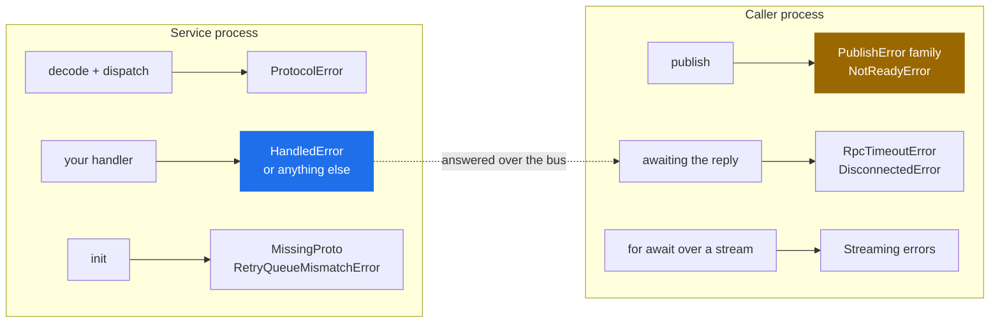
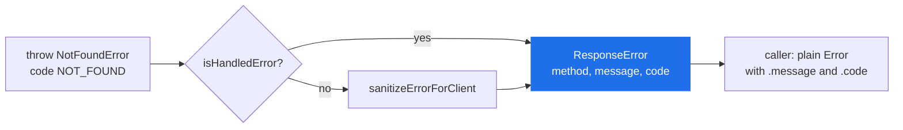

# Errors

> Every error class protobus exports, the exact condition that produces it, and whether retrying is safe.

**Read this if** you are writing a `catch` block, or you have an error in a log and want to know which side of the bus produced it.

| | |
|---|---|
| **Prerequisites** | [Error Handling](../guide/error-handling.md) — the retriable/terminal split |
| **Next** | [Custom Types](./custom-types.md) · [Configuration](./configuration.md) |
| **Source** | [`lib/errors.ts`](../../lib/errors.ts) · [`lib/connection.ts`](../../lib/connection.ts) · [`lib/message_dispatcher.ts`](../../lib/message_dispatcher.ts) · [`lib/message_listener.ts`](../../lib/message_listener.ts) · [`lib/priority.ts`](../../lib/priority.ts) |

**On this page** — [Which error am I looking at](#which-error-am-i-looking-at) · [Where each one comes from](#where-each-one-comes-from) · [Service-side errors](#service-side-errors) · [Caller-side errors](#caller-side-errors) · [Publish errors](#publish-errors) · [Streaming errors](#streaming-errors) · [Startup errors](#startup-errors) · [Writing your own terminal errors](#writing-your-own-terminal-errors) · [What crosses the wire](#what-crosses-the-wire)

---

## Which error am I looking at

Every row is verified against the class in [`lib/errors.ts`](../../lib/errors.ts) or the module named in the third column. **`code`** is the `code` property on the instance, which is also what travels to the caller in the response envelope; a dash means the class does not set one.

| Error | `code` | Thrown by | Retried? | What to do |
|---|---|---|---|---|
| `HandledError` | `HANDLED_ERROR` * | your handler | **never** — answered to the caller at once | nothing; this is the deliberate path |
| `ProtocolError` | `PROTOCOL_ERROR` | `MessageService` on an undecodable or misaddressed request | **never** — a `HandledError` | fix the caller or the schema; the same bytes fail identically forever |
| `InternalServiceError` | `INTERNAL_ERROR` | the error boundary, replacing an unhandled throw | the *original* error was retried to exhaustion first | join the `correlationId` in the message to the service's own log |
| `RpcTimeoutError` | `RPC_TIMEOUT` | `MessageDispatcher`, in the **caller** | no | nothing consumed the request, or the handler is slower than the budget |
| `DisconnectedError` | — | `MessageDispatcher`, when the socket drops mid-call | no | the outcome is unknown; reissue only if the call is idempotent |
| `NotReadyError` | `NOT_READY` | `Connection.whenReady()` | no | nothing was published — safe to retry |
| `ReconnectionError` | — | `Connection`, on giving up or being torn down mid-restore | no | the connection is finished; build a new one or exit |
| `PublishNackedError` | `PUBLISH_NACKED` | `Connection`, on `basic.nack` | no | definite failure, nothing stored — **safe to republish** |
| `UnroutableError` | `UNROUTABLE` | `Connection`, on a returned `mandatory` publish | no | no service is bound to that routing key |
| `PublishConfirmTimeoutError` | `PUBLISH_CONFIRM_TIMEOUT` | `Connection`, after `publishConfirmTimeoutMs` | no | **ambiguous** — see the caution below |
| `ChannelClosedError` | `CHANNEL_CLOSED` | `Connection`, channel closed with confirms outstanding | no | **ambiguous** — see the caution below |
| `StreamTimeoutError` | — | the caller's stream iterator, on the idle deadline | no | the producer stalled, or nothing was ever produced |
| `StreamBackpressureError` | — | the dispatcher, when a stream's buffer bound is exceeded | no | consume faster, or raise the bound |
| `StreamSequenceError` | — | the dispatcher, on a gap in `x-protobus-seq` | no | a chunk was lost; the partial stream is deliberately not yielded |
| `StreamClosedError` | — | **nothing raises it; deprecated in 2.3.0** | — | see [Streaming errors](#streaming-errors) |
| `InvalidMessageIdError` | — | `MessageDispatcher`, on a blank `CallOptions.messageId` | no | pass a non-empty id, or none at all |
| `CustomTypeConflictError` | — | `registerCustomType`, on a name re-registered with a different `wireType` | no | use a different name, or keep the original wire type |
| `InvalidPriorityError` | — | `validatePriority` / `validateMaxPriority`, before any broker I/O | no | fix the integer |
| `RetryQueueMismatchError` | — | `MessageListener` at queue declare | no | you changed `retryDelayMs` on a service that has already run |
| `MissingProto` | — | `MessageService`, at `init()` or on the `Proto` getter | no | the `.proto` is missing or declares no matching service |

\* `HANDLED_ERROR` is the default. The second constructor argument is the code, and in practice you always pass one.

> [!NOTE]
> `MissingProto` is exported from the package root **since 2.3.0**, so `instanceof MissingProto` works against an import from `protobus`. Before that it was reachable only by a deep import into [`lib/message_service.ts`](../../lib/message_service.ts), and callers matched on the message or on `err.constructor.name`.

> [!NOTE]
> **Every error class sets its own `name` since 2.3.0.** Twenty-four of them did not: declared as `class Foo extends Error {}`, they inherited `name` from `Error.prototype` and reported the literal string `'Error'`. That is what `safeErrorSummary()` reads, so a whole family of distinct failures arrived in the `x-last-error` header of a dead-lettered message indistinguishable from one another. If you have DLQ entries from 2.2.x or earlier, `x-last-error: Error` is that bug, not a nameless error.

---

## Where each one comes from

Two processes, and the error tells you which one it belongs to. That is usually the fastest way to narrow a report.



The dashed arrow is the only crossing: a service-side error reaches the caller as a `ResponseError` on the wire, never as the original class. [What crosses the wire](#what-crosses-the-wire) covers what survives that trip.

---

## Service-side errors

### `HandledError`

The one class most services will use. Throwing it says *retrying cannot help* — the error is encoded as the response and the delivery is settled with no retry ladder and no DLQ entry.

`isHandled` is a public `true` on every instance, and `isHandledError()` accepts anything carrying that flag, so an error class from another library qualifies without extending anything ([`lib/errors.ts:46`](../../lib/errors.ts)).

<!-- doc-check: compile id=handled-error -->
```typescript
import { HandledError, isHandledError, MessageService } from 'protobus';

class ValidationError extends HandledError {
    constructor(field: string) {
        super(`${field} is required`, 'VALIDATION_ERROR');
    }
}

abstract class OrdersService extends MessageService {
    async create(request: { customerId?: string }) {
        if (!request.customerId) throw new ValidationError('customerId');
        return { id: 'order-1' };
    }
}

// Duck-typed: no inheritance required, only the flag.
const foreign = Object.assign(new Error('rejected by the payment gateway'), {
    isHandled: true,
    code: 'PAYMENT_DECLINED',
});
console.log(isHandledError(foreign));   // true
```

Anything that is *not* handled — a plain `Error`, a `TypeError`, a driver timeout — is treated as an infrastructure failure and goes through the retry ladder described in [Architecture → When a handler fails](../concepts/architecture.md#when-a-handler-fails).

> [!WARNING]
> A plain `Error` keeps the caller waiting for the whole ladder. With the defaults (`maxRetries: 3`, `retryDelayMs: 5000`, both from `DEFAULT_RETRY_OPTIONS` in [`lib/message_service.ts:55`](../../lib/message_service.ts)) a permanently failing call parks its caller for roughly 15 seconds before any error is published back. The repo's own integration test carries this note and gives that one case a 90-second budget.

### `ProtocolError`

A `HandledError` subclass, so it is answered rather than retried — by definition, because a malformed message is malformed on every redelivery. Every condition that produces one lives in [`lib/message_service.ts`](../../lib/message_service.ts):

| Condition | Message |
|---|---|
| the `RequestContainer` did not decode | `request envelope did not decode` |
| the payload did not decode as the method's request type | `payload did not decode as the request type of …` |
| the routing key does not belong to this service, or contradicts the method in the body | raised as `InvalidMethodError`, a `ProtocolError` subclass |
| the contract declares no such method, or the service does not implement it | same |

The last two are the security checks: the body names the method, the routing key is what the broker actually matched, and a mismatch means a publisher tried to choose a handler the key did not authorise. `InvalidMethodError` is not exported from the package root either — on the wire it is simply `code: "PROTOCOL_ERROR"`.

### `InternalServiceError`

Not thrown by your code. `sanitizeErrorForClient()` substitutes it for an unhandled error on the way back to the caller, so a message written for the service's own operators — one that may quote a connection string or the row that failed — does not travel to another team's process.

> [!IMPORTANT]
> This substitution is **off by default**. `Config.exposeInternalErrors` reads `PROTOBUS_EXPOSE_INTERNAL_ERRORS` and defaults to `true` ([`lib/config.ts:78`](../../lib/config.ts)), which means the real message crosses unchanged. Set it to `false` on any service whose callers you do not control; the caller then gets `internal service error (correlationId …)` and the real exception stays in your log.

---

## Caller-side errors

### `RpcTimeoutError`

No reply arrived within the budget. The default is `Config.rpcCallTimeoutMs`, `RPC_CALL_TIMEOUT_MS`, **600000 ms** ([`lib/config.ts:121`](../../lib/config.ts)); a per-call `timeoutMs` argument overrides it.

The timer is armed *before* the publish, and firing it deletes the callback-map entry. That is the point of the class: before it existed, an unanswered request left the promise pending forever and leaked its map entry.

Three things produce it: nothing is bound to the routing key and the publish was not `mandatory`, the handler died without replying, or the handler is genuinely slower than the budget. Size the budget against `maxRetries × retryDelayMs`, not against one handler run.

### `DisconnectedError`

The socket dropped while the call was in flight. `MessageDispatcher._onDisconnected()` rejects **every** pending callback and fails **every** in-flight stream with a single instance ([`lib/message_dispatcher.ts:157`](../../lib/message_dispatcher.ts)), so a reconnect surfaces as a burst of these rather than a burst of timeouts.

The message is always `Connection lost during RPC call`. The outcome is unknown: the request may have been handled and its reply lost with the socket.

### `NotReadyError`

Distinct from a publish failure — *nothing was attempted*. A publish issued while the connection is being restored parks on `whenReady()` rather than failing, and `NotReadyError` is what ends that wait badly. Three ways ([`lib/connection.ts:311`](../../lib/connection.ts)):

- the connection has been closed (`the connection has been closed`);
- reconnection was abandoned after `maxRetries` attempts;
- the wait exceeded `Config.connectionReadyTimeoutMs` — `CONNECTION_READY_TIMEOUT_MS`, **30000 ms** — because a publisher parked on an unreachable broker has to be told eventually.

Because nothing was published, retrying cannot duplicate.

### `ReconnectionError`

Raised inside the connection machinery, on `max reconnection attempts (N) exceeded` (default `maxRetries: 10`, `0` meaning infinite) or when a generation is superseded mid-restore. When reconnection is abandoned, everything parked on readiness is rejected with a `NotReadyError` carrying the same text — so a *caller* normally sees `NotReadyError` and this class shows up in the connection's `error` event and in logs.

> [!NOTE]
> `ReconnectionError` and `DisconnectedError` do not set `this.name`, so both report `err.name === 'Error'`. Discriminate with `instanceof`, not by name.

---

## Publish errors

`PublishError` is the base class, and every subclass carries a **`messageId`** — stable across retries of the same logical message, and there precisely so a consumer can deduplicate after an ambiguous outcome.

A resolved `publish()` means all three of: the broker sent `basic.ack`, the message was routed if `mandatory` asked for routing to be enforced, and the channel's write buffer drained ([`lib/connection.ts`, `_confirmedPublish`](../../lib/connection.ts)). Anything else is one of these four.

| | Outcome | Republishing |
|---|---|---|
| `PublishNackedError` | definite: the broker refused it, nothing was stored | safe |
| `UnroutableError` | definite: confirmed, but returned before the confirm — it reached no queue | safe, once something is bound |
| `PublishConfirmTimeoutError` | **unknown** | may duplicate |
| `ChannelClosedError` | **unknown** | may duplicate |

> [!CAUTION]
> `PublishConfirmTimeoutError` and `ChannelClosedError` are **ambiguous, not failed**. The broker may have stored the message and lost only the confirm; the channel may have closed after the message was safely on disk. Retrying either can deliver it twice. Deduplicate on `messageId` at the consumer, or accept the duplicate — there is no third option, and treating an ambiguous outcome as a definite failure is how a "reliable" publisher double-books.

<!-- doc-check: compile id=publish-errors -->
```typescript
import {
    PublishError,
    PublishNackedError,
    UnroutableError,
    PublishConfirmTimeoutError,
    ChannelClosedError,
} from 'protobus';

function classify(error: unknown): 'safe-to-retry' | 'may-duplicate' | 'not-a-publish-error' {
    if (error instanceof PublishConfirmTimeoutError) return 'may-duplicate';
    if (error instanceof ChannelClosedError) return 'may-duplicate';
    if (error instanceof PublishNackedError) return 'safe-to-retry';
    if (error instanceof UnroutableError) return 'safe-to-retry';
    if (error instanceof PublishError) return 'may-duplicate';   // future subclasses: assume the worse
    return 'not-a-publish-error';
}

function idOf(error: unknown): string | undefined {
    return error instanceof PublishError ? error.messageId : undefined;
}
```

`UnroutableError` only reaches an RPC caller. `mandatory` is set for requests and deliberately **not** for events ([`lib/message_dispatcher.ts`, `publish`](../../lib/message_dispatcher.ts)) — an event with no subscribers is normal, and making that an error would break fan-out.

`ChannelClosedError` has one non-obvious origin. amqplib reports both a broker nack and a channel teardown through the same confirm callback, and the only discriminator left by the time protobus sees it is the message text: `/closed/i` picks the ambiguous case, everything else becomes `PublishNackedError`.

---

## Streaming errors

All four extend `StreamingError`, none of them sets a `code`, and all are raised in the **caller's** iterator. The unary `rpcCallTimeoutMs` does not apply to a stream: the deadline is per-chunk idleness, `Config.streamIdleTimeoutMs` (`STREAM_IDLE_TIMEOUT_MS`, **60000 ms**).

| Error | Condition | Default bound |
|---|---|---|
| `StreamTimeoutError` | no chunk within the idle window; also cancels the producer | 60000 ms |
| `StreamBackpressureError` | this call exceeded 1024 chunks or 64 MiB, or all calls together exceeded 256 MiB | `STREAM_MAX_BUFFERED_CHUNKS` / `_BYTES` / `STREAM_MAX_TOTAL_BUFFERED_BYTES` |
| `StreamSequenceError` | `x-protobus-seq` jumped, so at least one chunk was lost | — |
| `StreamClosedError` | **deprecated, never thrown** | — |

`StreamSequenceError` discards the chunks already buffered rather than yielding them. That is deliberate: a short stream that looks complete is worse than a visibly broken one.

> [!WARNING]
> **`StreamClosedError` is exported but never thrown, and is deprecated as of 2.3.0** — it will be removed in 3.0. Do not write a `catch` that depends on it.
>
> It was not revived, because every ending it was meant to describe already has a defined outcome and none of them is this one: a disconnect raises `DisconnectedError`, a stall raises `StreamTimeoutError`, an `AbortSignal` cancellation [deliberately ends the loop rather than raising](../guide/streaming.md#cancellation), and iterating after `return()` reports `done` because the async-iterator protocol requires it. Repurposing any of those would change behaviour callers already depend on.

<!-- doc-check: compile id=stream-errors -->
```typescript
import {
    StreamingError,
    StreamTimeoutError,
    StreamBackpressureError,
    StreamSequenceError,
    DisconnectedError,
} from 'protobus';

async function drain(chunks: AsyncIterable<{ text: string }>): Promise<string> {
    let out = '';
    try {
        for await (const chunk of chunks) out += chunk.text;
    } catch (error) {
        if (error instanceof StreamSequenceError) throw error;        // data is incomplete; do not use `out`
        if (error instanceof StreamTimeoutError) return out;          // producer stalled; partial is acceptable here
        if (error instanceof StreamBackpressureError) throw error;    // we are too slow; fix the consumer
        if (error instanceof DisconnectedError) throw error;          // the socket went, not the stream
        if (error instanceof StreamingError) throw error;
        throw error;
    }
    return out;
}
```

Full protocol in [Streaming](../guide/streaming.md).

---

## Startup errors

These two fail `init()`, before any message is handled. Both are worth recognising on sight because both are first-day errors.

### `MissingProto`

Two conditions, both in [`lib/message_service.ts`](../../lib/message_service.ts):

1. **`missing_proto_source`** — the default `Proto` getter did `fs.existsSync(this.ProtoFileName)` and the file is not there. With `RunnableService` the filename is derived by convention: `Orders.Service` → `Orders.proto`, resolved **relative to the process's working directory**, not to the source file. A service started from a different directory hits this, and the message says only `missing_proto_source`.
2. **`no service in the schema matches '<name>' or any prefix of it`** — the schema loaded, but `resolveContract()` trimmed `ServiceName` segment by segment and found no `service` block. `Combat.Player.player6` resolves because `Combat.Player` is declared; a typo in either the class or the `.proto` does not.

Fix (1) by overriding `ProtoFileName` with an absolute path, or by passing the proto directory to `context.init()`. Fix (2) by making the `.proto` declare the service the class serves.

### `RetryQueueMismatchError`

`retryDelayMs` becomes the retry queue's `x-message-ttl`, and RabbitMQ fixes queue arguments at declare time. Changing it for a service that has already run gives a `PRECONDITION_FAILED` on `queue.declare`; protobus catches that and rewrites it into a message that says what to actually do — drain and delete `<Service>.Retry`, or keep the original value. See [Queue Migration](../operations/queue-migration.md).

---

## Writing your own terminal errors

Subclass `HandledError` and give every class a stable `code`. The code is the part that survives the trip.

<!-- doc-check: compile id=domain-errors -->
```typescript
import { HandledError } from 'protobus';

export class NotFoundError extends HandledError {
    constructor(resource: string, id: string) {
        super(`${resource} ${id} not found`, 'NOT_FOUND');
    }
}

export class InsufficientFundsError extends HandledError {
    constructor(public readonly shortfallCents: number) {
        super(`short by ${shortfallCents} cents`, 'INSUFFICIENT_FUNDS');
    }
}
```

> [!IMPORTANT]
> **Extra properties do not cross the bus.** `ResponseError` carries exactly three fields — `method`, `message`, `code` ([`lib/message_factory.ts`](../../lib/message_factory.ts)). `shortfallCents` above exists in the service process and nowhere else. If the caller needs a value, put it in the `message` or, better, in the response message.

### What the caller actually receives

Not your class. `ServiceProxy` decodes the `ResponseError` and throws a **plain `Error`** with `message` set and `code` copied on when non-empty ([`lib/service_proxy.ts:101`](../../lib/service_proxy.ts)). So `instanceof NotFoundError` is `false` in the caller, and `isHandledError()` returns `false` there too — the `isHandled` flag is not on the wire.

Switch on `code`:

<!-- doc-check: compile id=caller-side-codes -->
```typescript
export interface WireError extends Error { code?: string }

export async function placeOrder(call: () => Promise<{ id: string }>) {
    try {
        return await call();
    } catch (error) {
        switch ((error as WireError).code) {
            case 'NOT_FOUND':          return null;
            case 'INSUFFICIENT_FUNDS': throw error;          // the user must act
            case 'VALIDATION_ERROR':   throw error;          // our bug; do not retry
            case 'RPC_TIMEOUT':        return placeOrder(call);
            default:                   throw error;
        }
    }
}
```

No code is shared between the two sets — the wire carries `HANDLED_ERROR`, `PROTOCOL_ERROR`, `INTERNAL_ERROR` and whatever you define, while `RPC_TIMEOUT`, `NOT_READY` and the publish codes are set locally — so one `switch` can cover both origins without ambiguity.

> [!NOTE]
> A local code can still reach a *further* caller when services are chained. Service B calling service C gets an `RpcTimeoutError`, which is not a `HandledError`, so it runs B's retry ladder and is finally answered to A as `code: "RPC_TIMEOUT"`. The code is unambiguous; the hop it happened on is not, which is what `correlationId` is for.

---

## What crosses the wire



Three fields, one class on the far side. Everything else — the class, the stack, extra properties, the `isHandled` flag — is local to the service process.

One more surface worth knowing: a failed message stamps `x-last-error` on its retry and DLQ copies, and that header is written by `safeErrorSummary()`. For a `HandledError` it is `Name[CODE]: message`; for anything else it is `Name[code]` or just `Name`, with **the message deliberately omitted** — exception text routinely interpolates the data that caused it, and a DLQ entry outlives the incident. See [Architecture → headers](../concepts/architecture.md#when-a-handler-fails).

---

<div align="center">

**[← CLI](./cli.md)** · **[Docs index](../README.md)** · **[Custom Types →](./custom-types.md)**

</div>
